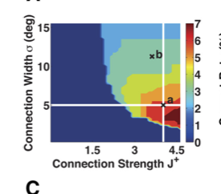
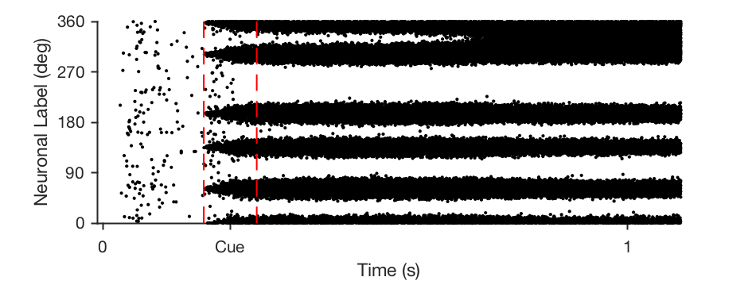

# Recurrent neural networks for multi-item working memory and its capacity in a delayed-response task

## Introduction

This is the core code to implement the network simulation for multi-item working memory in delayed response task (Wei et al., J. Neurosci., 2012).

## Input parameters

* root_dir_nowthe: directory of the recording data
* datanum: index of the simulation
* t_end: length of the simulation (in ms)
* n_stimuli: number of the stimuli
* t_stimuli: type of the stimuli: 'u' (uniform) or 'r' (random) or 'c' (a given cue array)
* mini_diff: minimum distance between the neighbouring stimuli (deg).This parameter must be given if type of the stimuli is 'r' (random). For uniform case, 'mini_diff' can be any number. A referenced value of it is 24 in Zhang & Luck (Psychol. Sci., 2009)
* pyr_input: [sample_on, sample_off] times. Referenced values are [250, 500]) in Wei et al., 2012; [200, 300] in incoming book chapter of Wang.

## Output files
* pyramidal cells: [root_dir,'pyr_cell_',num2str(datanum),'.txt'];
* interneuorns: [root_dir,'inh_cell_',num2str(datanum),'.txt'];
* first column: index of the neuron that fires
* second column: the firing time

## Fun part I -- tweaking around the network structure parameter
To tweak around working memory capacity of network, one can change the parameters related to E-E connection. In Wei et al. (J. Neurosci., 2012), I made a substantial change of these parameters on sigma-J+ space (Fig. 3A, Wei et al., J. Neurosci., 2012). The fun part of the outcomes is that one cannot only this as a reference to model a limited number of working memory process, but also use this result as a reference to determine the parameter space where such a ring model would be use for decision making (working memory capacity = 1) for delayed response task (Wei and Wang, J. Neurophysiol., 2015) or other similar task.

## Fun part II -- working memory is a dynamical process of online holding important information used for the incoming task.
The network employs a substantial amount of noise, which can result in completely different activity pattern even starting from essentially the identical cues.

For fun, one can simulate the following code for 100 times (where idx from 1 to 100).

    www_memory(idx, 5, './', [200 300], 1100, 'c', [61 135 195 301 358])
    
You would expect to see simulations with, even dramatically, distinguishable patterns.

Therefore, merge and dying-out are some innate network mechanisms that could lead stochastically to a failures of memory, which is an alternative to the hypothesis of preallocation of visual resource (using attention) during sampling (Bays and Husain, Science, 2008).

## Acknowledgments

This code is based on Matlab code from Moran Furman 

Furman M and Wang X-J (2008), 
_Similarity effect and optimal control of multiple-choice decision making_,  
Neuron 60: 1153-1168 
[ [PDF] ](http://www.cns.nyu.edu/wanglab/publications/pdf/furman.neuron2008.pdf)

## License

MIT

## Citation

This code is the product of work carried out with Da-Hui Wang at Beijing Normal University and Xiao-Jing Wang at New York University. If you find our code helpful to your work, consider giving us a shout-out in your publications:

Wei Z, Wang X-J, Wang DH (2012), 
_From distributed resources to limited slots in multiple-item working memory: a spiking network model with normalization._
J. Neurosci., 32: 11228-11240. 
[ [PDF] ](http://www.cns.nyu.edu/wanglab/publications/pdf/wei_JNS2012.pdf)
